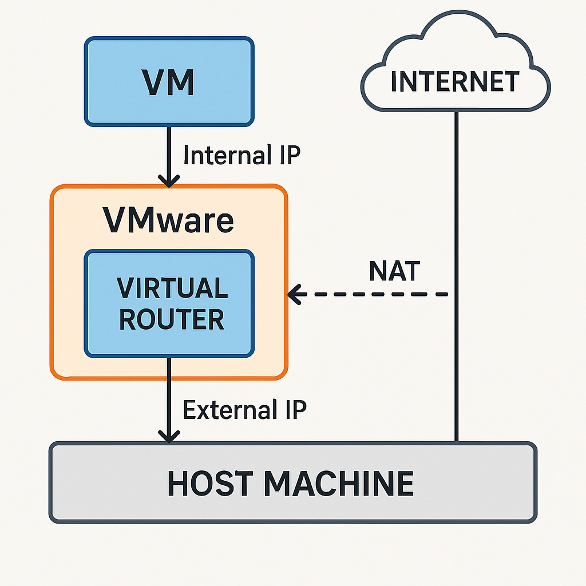

# networking-setup.md

In this file I am configuring networking for both virtual machines so that Windows Server and Rocky Linux can communicate reliably and eventually allow Active Directory domain integration. Networking is one of the most important parts of this lab because Active Directory depends on DNS, stable IP addressing, and correct hostname configuration. If networking is wrong, domain joining will fail later.

---

<br>
<br>

## Understanding Virtual Networking in VMware

- VMware Workstation provides virtual networks. These are software-defined networks that act like real network segments. Each VM connects to one of these networks through a virtual network interface card. I am not using a physical network cable here, but the VM thinks it has a real network card and real network communication.

- When VMware creates these virtual networks, it also creates a virtual switch and virtual NAT or bridging system. This means each VM can communicate with other VMs in the same virtual network, and also reach the outside world depending on the mode I select.

<details>
<summary><b>Q. (NIC) Network Interface Card</b></summary>
<br>
- A NIC in this context means the “network interface” for the VM. Think of it as the part of the system that sends and receives network data. In a physical computer this would be a network port or Wi-Fi card, but inside VMware it’s virtual.

- The VM still needs something that handles network communication, so VMware gives it a virtual NIC. That way the VM can get an IP address, talk to other machines, access the network, or reach the internet—exactly like a real computer would.

</details>

---


## NAT Networking Explained

- With NAT networking, my VMs sit behind a virtual router that VMware creates. When my VM goes to the internet, that virtual router sends the traffic through my host computer. From the internet’s point of view, it looks like my host is the one talking, not the VM.

- NAT keeps my VMs isolated from my real network. Only VMware and my host know the VM’s internal IPs. This is useful in a lab because my virtual machines can’t accidentally mess with my real network.

- For example, if my Windows Server in the VM tries to act as a DNS or DHCP server, NAT stops it from affecting my actual network.



---

<br>
<br>

## Bridged Networking Explained

- With bridged networking, my VM acts like it’s another real device on my physical network. It gets an IP address from the actual router, and other devices on my network can talk to it directly.

- This can be useful, but it also means I might accidentally expose my lab services to the real network. It also means my VM’s IP address depends on whatever the physical network’s DHCP server gives it.

---

<br>
<br>

## Host-Only Networking Explained

- With host-only networking, my <mark>VM can only talk to my host</mark> and to other VMs that are also host-only. It doesn’t get internet access by default. This is very secure, but without internet it’s harder to update packages or install tools.

- Host-only mode is good when I want an isolated environment, like for penetration testing, but for Active Directory joins or installing packages, I need internet access.


---

<br>
<br>

## Why NAT Is the Correct Choice for This Lab

My goal is:
- keep the environment isolated,
- keep VMs talking to each other,
- allow internet access for updates,
- avoid exposing Domain Controller services to the physical network.

NAT satisfies all of these goals. The Windows Server and Rocky Linux VMs will receive virtual IP addresses within the same NAT network, so they can communicate.

---

<br>
<br>

## Checking IP Addresses

After both systems are installed, I check their IP addresses.

On Windows Server:
```
ipconfig
```

On Rocky Linux:
```
ip addr
```

These commands show the assigned IP address. Under NAT configuration, both machines receive IP addresses from VMware’s virtual DHCP service.

---

<br>
<br>

## Why I Need Static IP Addresses Later

A Domain Controller needs a predictable IP address because clients must always reach it at the same address. If the Domain Controller uses DHCP, its IP might change, which causes DNS failures and domain login failures.

Therefore, after confirming the network works, I configure a static IP address on Windows Server. This step is not optional for Active Directory. Rocky Linux will also need a stable configuration when joining the domain.

<br>
<details>
<summary><b>DHCP</b></summary>
<br>

- DHCP automatically gives an IP address to my machine on the network. Instead of me manually configuring IP, gateway, DNS, etc., the DHCP server assigns those settings for me.

- So when my VM or computer joins a network, DHCP just hands out the network details and I’m ready to connect.

</details>
<br>

---

<br>
<br>

## DNS Is Critical for Active Directory

Active Directory depends heavily on DNS. The Domain Controller will run DNS services. Linux will rely on that DNS server to locate Kerberos services and domain controllers. If DNS configuration is wrong, authentication will fail.

At this stage, I am only verifying that the network works. DNS configuration will be set up when promoting Windows Server to a Domain Controller.

---

<br>
<br>

## Hostname Considerations

Each machine needs a meaningful hostname. Windows Server will eventually have a fully qualified domain name once it becomes a Domain Controller. For now, I give it a short hostname such as:

```bash
prashantgohel
```

For Rocky Linux, I set a hostname such as:

```bash
rocky01
```

I can change the hostname in Rocky Linux with:

```bash
hostnamectl set-hostname rocky01
```

Hostnames matter for identification. Once the AD domain exists, Linux will use the domain’s DNS and hostname structure.

---

<br>
<br>

## Verifying Connectivity Between Machines

Once both machines have IP addresses, I test connectivity.

From Windows Server:
```
ping <rocky-ip>
```

From Rocky Linux:
```
ping <windows-server-ip>
```

If both directions succeed, basic connectivity is confirmed. If ping fails, DNS is not involved yet, so this test checks only basic network communication.

---

<br>
<br>

## Preparing for Static IP on Windows Server

At this stage, I only confirm networking works. When I install Active Directory Domain Services, I will configure static IP addressing and DNS settings on Windows Server. Only after that will I promote it to a Domain Controller.

This order of steps avoids configuration mistakes. Domain promotion before static IP can cause serious problems with DNS later.

---

<br>
<br>

## What I Achieve After This File

By the end of this networking setup, both systems are connected through VMware NAT networking. They can communicate with each other and with the internet. Hostnames are set, and I understand the differences between NAT, bridged, and host-only networking.

The next steps will involve configuring static IP on Windows Server, installing DNS and AD DS, and promoting it to a Domain Controller.